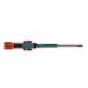
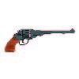
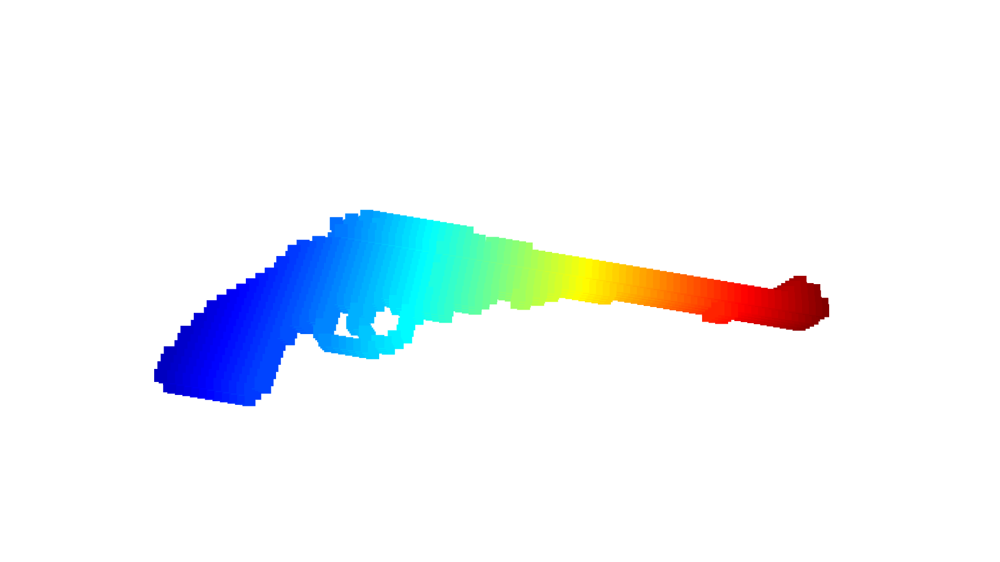
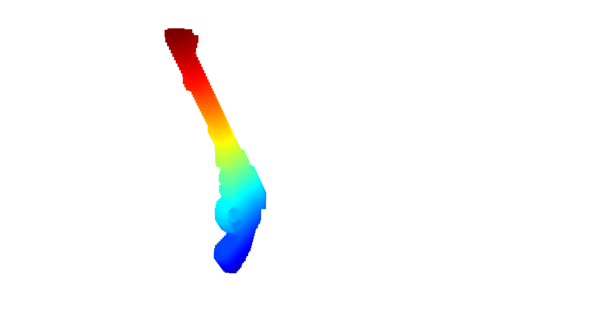

Space carving is a technique used to create 3 dimensional models from multiple 2D images.

This is a basic implementation made from scratch that assumes that the 2 orthogonal images were taken from the same distance, with same focal length.

With this assumption we can simplify space carving quite a bit with its biggest advantage being that it doesn't require the extrinsic matrix.

The 3D gun model shown below has been generated using 2 100x100 pictures of guns (low resoltuion taken to speed up visualization, higher resolutions can be used as well). The output model obtained was satisfactory. The model has also been saved as a ply file.
The ply file was further converted to pcd file using MATLAB with the following MATLAB code:-

```
ptCloud = pcread("out.ply")

pcwrite(ptCloud,'out.pcd','Encoding','ascii');
```

Input images:-




Screenshots of model:-





